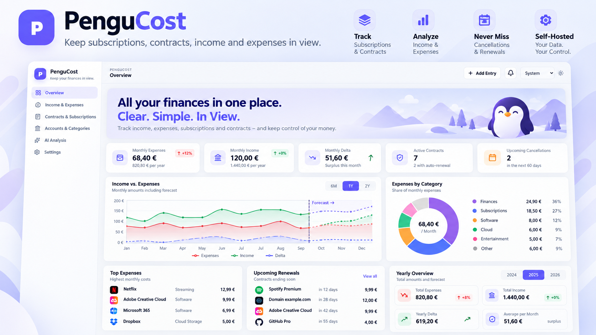

<p align="center">
  
</p>

# PenguCost 🐧💶

**PenguCost is a modern self-hosted dashboard for recurring income, expenses, subscriptions and contracts.**
It normalizes different billing cycles, keeps price history intact, tracks cancellation dates and renewals, compares income with expenses and can optionally use AI to analyse your own financial data.

PenguCost is designed to stay simple: **see what regularly comes in, what goes out and where you can act.**

Local multi-user accounts are isolated from each other. Users can change their own passwords in Settings, while administrators can reset any local account password from User management.

---

## Proxmox VE

### New installation

Run this directly on the **Proxmox host as `root`**:

```bash
bash <(curl -fsSL https://raw.githubusercontent.com/Borderlane-HA/PenguCost/main/scripts/proxmox-install.sh)
```

The guided installer supports Proxmox VE 8/9 and creates an **unprivileged Debian LXC**. Docker and PenguCost are installed **inside the LXC**, not on the Proxmox host.

You can choose Quick Setup or Advanced Setup for VMID, CPU, RAM, disk, storage, network, VLAN, port and source version. Quick Setup currently uses a **16 GB root disk** to leave enough workspace for Docker and frontend builds.

After installation open:

```text
http://LXC-IP:8080
```

On first start, create the first administrator account.

### Backup

Replace `<VMID>` with the PenguCost LXC ID, for example `103`:

```bash
pct exec <VMID> -- /usr/local/sbin/pengucost-backup
```

Backups are stored inside the LXC under:

```text
/var/backups/pengucost/
```

List available backups:

```bash
pct exec <VMID> -- ls -lh /var/backups/pengucost/
```

### Restore

Restore a backup from the Proxmox host:

```bash
pct exec <VMID> -- /usr/local/sbin/pengucost-restore /var/backups/pengucost/<backup-file>.tar.gz
```

Example:

```bash
pct exec 103 -- /usr/local/sbin/pengucost-restore /var/backups/pengucost/pengucost-backup-20261001-120000.tar.gz
```

The PenguCost container is stopped during restore and started again afterwards.

### Update

Update to the current `main` branch:

```bash
pct exec <VMID> -- /usr/local/sbin/pengucost-update main
```

Update to the latest published release/tag:

```bash
pct exec <VMID> -- /usr/local/sbin/pengucost-update stable
```

Update to a specific version:

```bash
pct exec <VMID> -- /usr/local/sbin/pengucost-update v0.5.2
```

The Proxmox updater automatically creates a backup before applying the update and performs a health check afterwards. It also cleans stale Docker build cache before the build and checks that enough free disk space is available. If an older small LXC runs out of space, enlarge it on the Proxmox host, for example with `pct resize <VMID> rootfs +8G`. The update helper is source-controlled and refreshes itself after successful updates.

---

## Docker

### New installation

Requirements: **Docker Engine + Docker Compose**.

```bash
git clone https://github.com/Borderlane-HA/PenguCost.git
cd PenguCost
docker compose up -d --build
```

Open:

```text
http://SERVER-IP:8080
```

On first start, create the first administrator account.

### Backup

From the PenguCost repository directory:

```bash
bash scripts/backup.sh ./pengucost-backup-$(date +%Y%m%d-%H%M%S).tar.gz
```

The command prints the path of the created backup when finished.

### Restore

```bash
bash scripts/restore.sh ./pengucost-backup-YYYYMMDD-HHMMSS.tar.gz
```

The PenguCost container is stopped during restore and started again afterwards.

### Update

Create a backup first:

```bash
bash scripts/backup.sh ./pengucost-preupdate-$(date +%Y%m%d-%H%M%S).tar.gz
```

Then update the source and rebuild:

```bash
git pull --ff-only
docker compose up -d --build
```

Check the running container:

```bash
docker ps --filter name=pengucost
```

---

## What PenguCost can do

- recurring and **one-time income and expenses** with monthly, quarterly, half-yearly, yearly and custom billing cycles
- normalized monthly/yearly values and **income vs. expense delta**
- historical price phases without changing past reporting
- contract start/end, notice periods, cancellation deadlines, automatic renewals and optional renewal prices
- reminder center for upcoming cancellation and renewal dates
- yearly history, previous-year comparison and explainable future projections from known price and contract data
- global admin templates plus private per-user accounts, cards/payment methods and categories
- strict separation of financial data between users
- personal JSON export/import plus complete administrator backup/restore
- Excel-style sorting/filtering, saved views, configurable columns and bulk actions
- contract/customer links, duplicate warnings, tags, estimates and change history
- optional provider/brand icons with provider-website fallback, checked on save and refreshed every 24 hours when enabled
- German and English UI
- multiple themes
- **Bank statement assistant**: PDF/JPG/PNG uploads, repeated debit/income detection with counts and evidence, manual review and sequential import
- persistent **PenguCost AI Agent** with chat history, Brain memory and admin-managed AI profiles
- Ollama, OpenAI, Grok/xAI, Gemini, IONOS AI Model Hub, Claude and custom compatible endpoints

## Data & privacy

PenguCost is **local-first**. Core operation does not require Internet access after installation. Internet is only needed for updates, optional external AI providers and optional provider-icon refreshes when that feature is enabled. Provider icons are cached locally.

Each user's financial data, reminders, AI history and Brain are isolated from other users. Administrators manage shared configuration and AI profiles but do not browse other users' financial data through the normal UI.

All persistent application state is stored in the PenguCost Docker volume.

## Repository

```text
backend/      FastAPI backend
frontend/     React + Vite frontend
scripts/      install, backup, restore and update helpers
docs/         project documentation and assets
```

See also:

- [`CHANGELOG.md`](CHANGELOG.md)
- [`SECURITY.md`](SECURITY.md)
- [`docs/ARCHITECTURE.md`](docs/ARCHITECTURE.md)
- [`docs/ROADMAP.md`](docs/ROADMAP.md)

## License

See [`LICENSE`](LICENSE).


## Bank statement assistant (0.5.0)

Open **AI Agent → Bank statements / Kontoauszüge**. Upload multiple statements
from the same account (ideally 3–12 months), select an enabled AI profile and the
account for new entries, then confirm processing by that profile.

The assistant shows repeated counterparties such as **Netflix 4×** or **HUK24
8×**, the latest/minimum/maximum amount, the observed date range, suggested
monthly/quarterly/half-yearly/yearly cadence, confidence and each source page.
Counts represent actual extracted transactions, not a multiplier for the entry
amount. A suggestion needs at least two occurrences. Irregular repeat purchases
are marked for manual review rather than treated as proven subscriptions.

Choose **Review & import** for one suggestion, or select several and review them
one by one. The ordinary entry editor is prefilled; correct the amount, income
or expense direction, currency, billing interval, category, account and dates.
Confirm the review before saving. Nothing is created just by uploading. Possible
existing entries are shown; importing the same candidate twice is blocked.

Limits: **10 files, 20 MB total, 40 pages** per analysis, one running analysis
per user and two globally. Text PDFs use local text extraction and can be analyzed
by text-only models. Photos/scanned PDFs are converted to bounded JPEG pages and
require an image-capable model at the selected provider. Claude's image format
and OpenAI-compatible endpoints are supported; actual compatibility and output
capacity depend on your selected model. Ollama requests process one page; other providers process at most two
pages. Ollama profiles default to **Automatic / no fixed output limit**; a manual
limit remains optional. Other providers default to 8,000 tokens. Model context
windows and server limits still apply. Statement requests wait up to 30 minutes;
empty answers, reasoning-only answers, truncation and provider filtering produce
distinct error messages. Ollama statements use the native `/api/chat` endpoint, JSON output, thinking
disabled and an explicit context window (default 32,768 tokens, configurable in
Settings). See the [0.5.2 update notes](UPDATE-0.5.2.md).

Raw uploads are temporary and never written into the PenguCost data volume.
Results are encrypted with the installation's existing Fernet key and isolated
per user. External providers receive the statement content after confirmation;
their own retention rules apply. Results remain until you delete the analysis;
deleting it also cancels pending work, but keeps imported finance entries.
Completed results survive application restarts; running analyses must be
uploaded again. User/admin JSON exports intentionally omit statement results;
volume backups include the encrypted results and matching encryption key.

The proposed amount is the **latest observed amount**, never the sum of all
occurrences. A new draft starts today so a later observed price is not applied
retrospectively to the whole observed period. Statement dates do not establish
contract dates or cancellation terms. The dashboard has no foreign-exchange
conversion; manually convert non-EUR proposals to EUR and change their draft currency
before import. The statement importer blocks unconverted non-EUR entries.

Details and review findings: [Statement assistant](docs/STATEMENT-ASSISTANT.md),
[Project review](docs/PROJECT-REVIEW-0.5.0.md).
